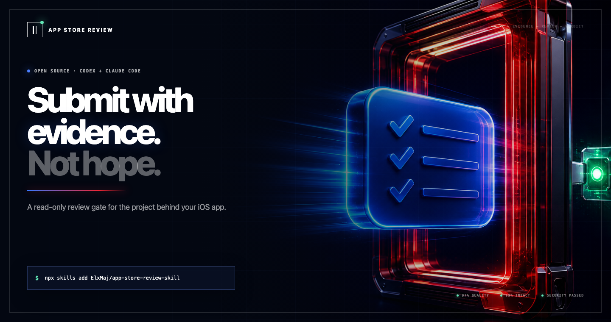
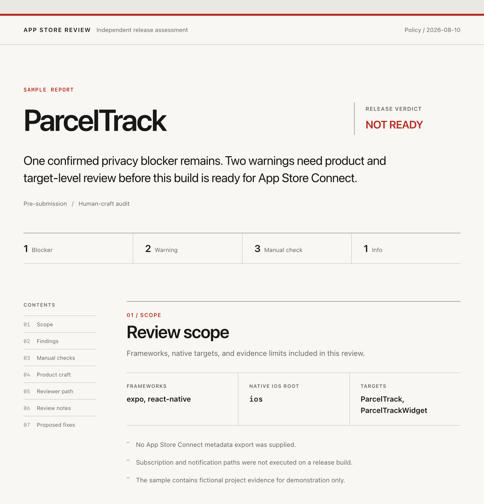

<div align="center">

<a href="https://elxmaj.github.io/app-store-review-skill/"></a>

# App Store Review Skill

**The evidence-first preflight for iOS apps.** Audit before submission, recover from rejection, and find the product details that still feel generic or unfinished.

[](LICENSE) [](https://developer.apple.com/app-store/review/guidelines/) [](https://tessl.io/registry/maj-labs/app-store-review) [](https://www.claudepluginhub.com/plugins/elxmaj-app-store-review?ref=badge)

[Product page](https://elxmaj.github.io/app-store-review-skill/) · [Star on GitHub](https://github.com/ElxMaj/app-store-review-skill) · [Open the complete sample report](https://elxmaj.github.io/app-store-review-skill/report/) · [Inspect its source JSON](https://elxmaj.github.io/app-store-review-skill/report/parceltrack-report.json)

</div>

## Install

```bash
npx skills add ElxMaj/app-store-review-skill
```

Then ask your agent:

```text
Audit this iOS app before submission. Report first and do not edit files.
```

The skill works with **Codex and Claude Code**, detects Xcode, Expo, React Native, and Flutter projects, and changes **zero files** on its first pass. [See every install method](INSTALL.md), including Tessl and the Claude Code marketplace.

## Why a review gate?

A build can work perfectly on your phone and still give App Review a broken path. A widget may have no privacy manifest. A camera call may not match its purpose string. Account deletion may stop inside the app. Review notes may omit the only usable test account. A polished interface may still look like an interchangeable template.

The skill collects those signals before offering advice. Every finding answers four questions:

| Evidence contract | What you get |
|---|---|
| **What was found** | A confirmed repository signal, warning, or explicit manual check |
| **Where it lives** | A target, file, metadata field, or real-build checkpoint |
| **Why it matters** | Published guidance, labeled evidence, or a clearly stated inference |
| **How to verify** | A repeatable command, device check, or App Store Connect check |

Unknowns stay unknown. The report arrives before any proposed fix group.

## Three review modes

### 01 · Pre-submission audit

Checks native targets, purpose strings, privacy manifests, Required Reason APIs, purchases, restore paths, account deletion, Sign in with Apple, ATT, third-party AI consent, typed metadata, placeholders, shipped internal files, reviewer access, iPad behavior, and release paths.

### 02 · Rejection recovery

Preserves Apple’s exact message and classifies the next move as `FIX`, `CLARIFY`, `APPEAL`, or `REQUEST INTERPRETATION`. It traces the likely cause, keeps published rules separate from community evidence, and drafts a Resolution Center reply with exact navigation and build details.

### 03 · Human-craft audit

Reviews product distinction, provenance, visual identity, microcopy, missing states, accessibility, motion, and App Store product-page specificity. Grades are `DISTINCT`, `CREDIBLE`, `GENERIC`, `HIGH RISK`, or `UNVERIFIED`.

## The artifact

<a href="https://elxmaj.github.io/app-store-review-skill/report/"></a>

The reviewed JSON becomes a self-contained editorial report, not a fake dashboard. It includes the release verdict, evidence confidence, reviewer checklist, App Review Notes draft, and approval-required fix groups. The same evidence is available as stable JSON for CI, issue reports, and later audits.

## Use it

```text
/app-store-review Audit this Expo app before submission. Report first and do not edit files.
/app-store-review Apple rejected build 42 under 4.3(a). Find the cause and draft my reply.
/app-store-review Run the human-craft audit. Show what feels generic or unfinished.
/app-store-review Audit this iPad app's Apple design quality, including motion and gestures.
```

For deterministic scanning outside an agent:

```bash
python3 scripts/app_store_review_scan.py <project-path> --format all --output-dir <report-directory>
```

Add typed metadata with `--metadata FIELD[:LOCALE]=PATH` and Fastlane trees with `--metadata-root PATH`.

## Coverage

| Guideline family | What is reviewed |
|---|---|
| 1.2 | UGC filtering, reporting, blocking, contact details, moderation, and anonymous chat |
| 2.1 | Crashes, placeholders, demo access, broken paths, network behavior, and iPad reviewability |
| 2.3 | Build-to-metadata accuracy, localizations, fallback assets, screenshots, keywords, age rating, and purchase claims |
| 3.1 | Digital purchases, paywall terms, StoreKit pricing, trials, and restoration |
| 4.2 / 4.3 | Minimum functionality, templates, portfolio duplication, provenance, and distinct value |
| 5.1 | Purpose strings, privacy manifests, deletion, ATT, labels, and third-party AI consent |

Apple’s published guidelines do not name AI-written code as a rejection category. They do assess the product that ships. Read the source-based guide to [Guidelines 4.2.6 and 4.3](https://elxmaj.github.io/app-store-review-skill/guides/will-apple-reject-ai-built-apps/).

## Keep the evidence current

[`references/research-prompt.md`](references/research-prompt.md) is a quarterly research prompt for checking official policy changes and refreshing rejection evidence. New cases must include the guideline, Apple’s wording when available, the response, outcome, date, and source URL.

## Project map

```text
SKILL.md                          Workflow and review rules
references/                       Policy, recovery, craft, and framework guidance
scripts/app_store_review_scan.py  Read-only deterministic scanner
scripts/render_app_store_report.py Self-contained report renderer
scripts/tests/                    Regression tests
evals/                            Behavior and trigger cases
.claude-plugin/ · .codex-plugin/  Claude Code and Codex manifests
```

## Contributing

Real rejection cases and false-positive reports are welcome. Read [CONTRIBUTING.md](CONTRIBUTING.md) first, and never publish credentials, signing material, personal data, or private app details.

Built by [Elie Majorel](https://github.com/ElxMaj) · Published by [Maj Labs](https://tessl.io/registry/maj-labs) · [MIT licensed](LICENSE)

This project checks public Apple guidance and clearly labeled community evidence. It cannot guarantee approval, does not contact Apple, and is not affiliated with or endorsed by Apple Inc.
